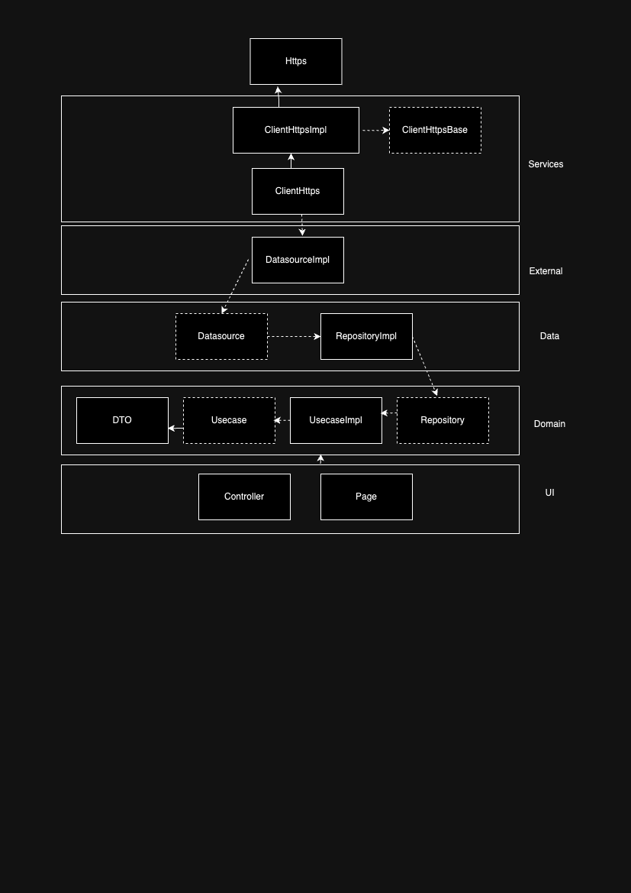
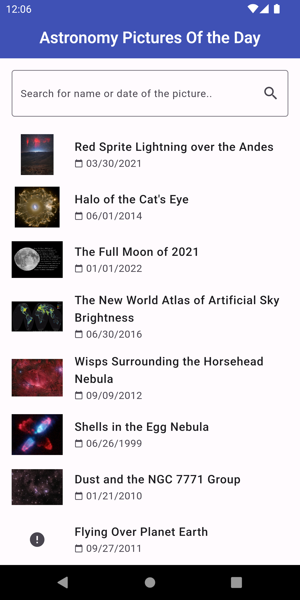
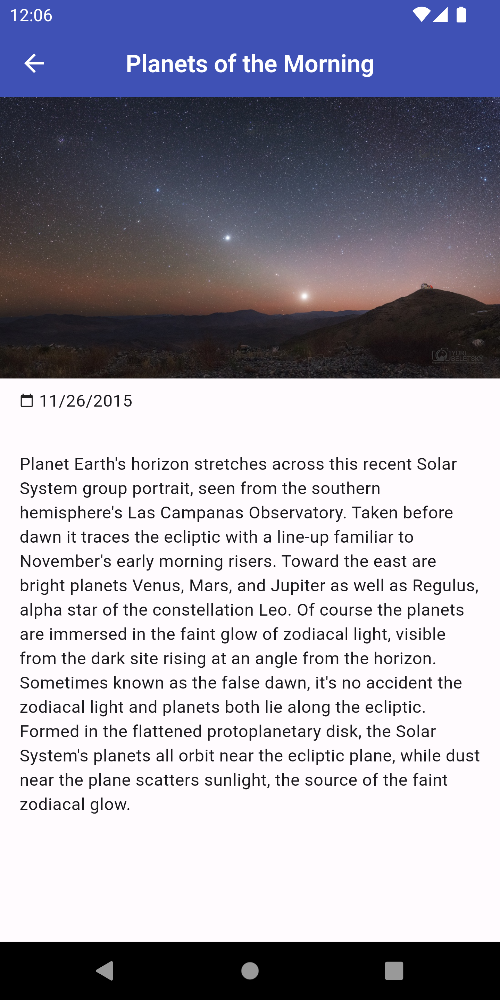

  <row>
    
    
  </row>

  <h3>APOD - Astronomy Picture Of the Day</h3>
  
APOD App is a mobile application for Android developed using Flutter. This application presents a list of Pictures Of the Day from Nasa and its details of each picture. It works online and offiline the list of pictures is saved in cache after the first load. If you are not connected to the internet on first loading, the app will show a server error message.

 

## Overview
1. **[Requirements 📝](#requirements-)**
2. **[Developing 👷](#developing-)**
3. **[Tests 👷](#testing-)**
4. **[Architecture ⚙️](#architecture-)**
5. **[App Images 📱](#app-images-)**

## Requirements 📝
#### To execute this project it is necessary to have the following dependencies installed and configured on your machine:

**Required**
- [Flutter](https://flutter.dev/)
- [Android SDK](https://developer.android.com/studio)
- You will need an API key, you can get one [here](https://api.nasa.gov/). Now with your API_KEY on hands paste it into the env.json environment variable.

**Versions**
- [Flutter](https://flutter.dev/) `3.19.5`
- [Dart](https://dart.dev/) `3.3.3`

## Developing 👷
#### Use a local development environment:

1. [Clone this repo](https://docs.gitlab.com/ee/gitlab-basics/start-using-git.html) with git.
2. Install dependencies by running `flutter packages get` or `flutter pub get` within the directory that you cloned (probably `app`).
3. Open any android device emulator of your choice.
4. Execute your app with `flutter run --dart-define-from-file=env.json` or F5 (debug mode).

## Testing 👷
- To run the tests use this command: `flutter test`

## Architecture
#### This architecture is based in Clean Architecture and SOLID principles, and the UI layer is based in MVP principles. Below is an image of the architecture.

  <row>
    
  </row>

## App Images

This section shows images of application.

  <row>
    
  </row>

  <row>
    
  </row>

